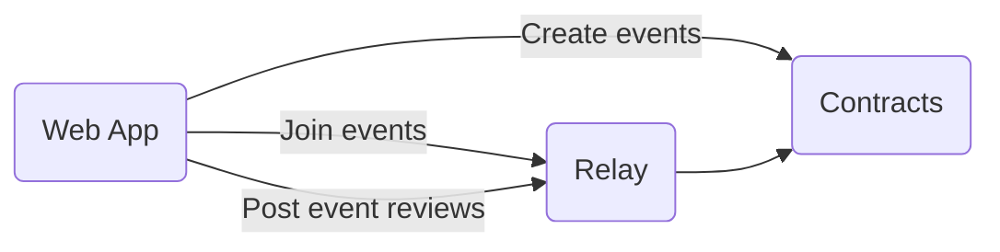

<p align="center">
    <h1 align="center">
        <picture>
            <source media="(prefers-color-scheme: dark)" srcset="https://github.com/semaphore-protocol/website/blob/main/static/img/semaphore-icon-dark.svg">
            <source media="(prefers-color-scheme: light)" srcset="https://github.com/semaphore-protocol/website/blob/main/static/img/semaphore-icon.svg">
            
        </picture>
        Semaphore Boilerplate
    </h1>
</p>

<p align="center">
    <a href="https://github.com/semaphore-protocol" target="_blank">
        
    </a>
    <a href="https://github.com/semaphore-protocol/boilerplate/blob/main/LICENSE">
        
    </a>
    <a href="https://github.com/semaphore-protocol/semaphore.js/actions?query=workflow%3Astyle">
        
    </a>
    <a href="https://eslint.org/">
        
    </a>
    <a href="https://prettier.io/">
        
    </a>
</p>

| The repository is divided into three components: [web app](https://github.com/semaphore-protocol/boilerplate/tree/main/apps/web-app), [relay](https://github.com/semaphore-protocol/boilerplate/tree/main/apps/relay) and [contracts](https://github.com/semaphore-protocol/boilerplate/tree/main/apps/contracts). The app allows users to create their own Semaphore identity and create events where only members can post reviews anonymously. |
| ------------------------------------------------------------------------------------------------------------------------------------------------------------------------------------------------------------------------------------------------------------------------------------------------------------------------------------------------------------------------------------------------------------------------------------------------- |



## 🛠 Install

Use this repository as a Github [template](https://github.com/semaphore-protocol/boilerplate/generate).

Clone your repository:

```bash
git clone https://github.com/<your-username>/<your-repo>.git
```

and install the dependencies:

```bash
cd <your-repo> && yarn
```

## 📜 Usage

Copy the `.env.example` file as `.env`:

```bash
cp .env.example .env
```

and add your environment variables.

ℹ️ You can use the default ones to start the app in a local network.

### Start the app

Run the following commands sequentially in three separate tabs of the terminal:

```bash
yarn start:contracts
```

```bash
yarn start:web-app
```

```bash
yarn start:relay
```

### Code quality and formatting

Run [ESLint](https://eslint.org/) to analyze the code and catch bugs:

```bash
yarn lint
```

Run [Prettier](https://prettier.io/) to check formatting rules:

```bash
yarn prettier
```

or to automatically format the code:

```bash
yarn prettier:write
```
